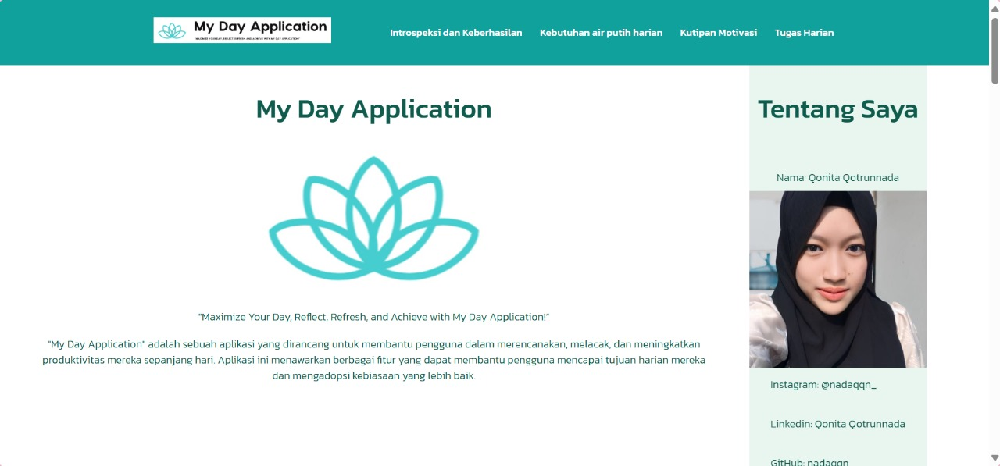
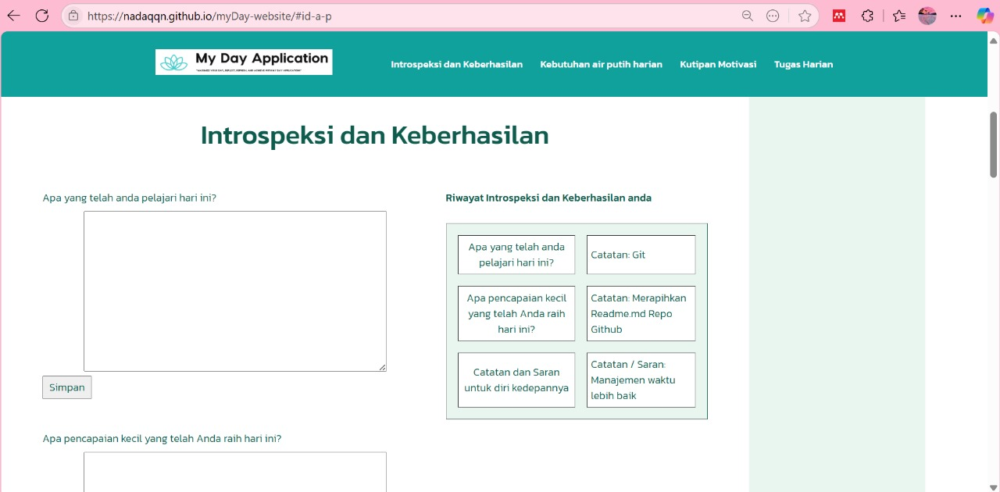
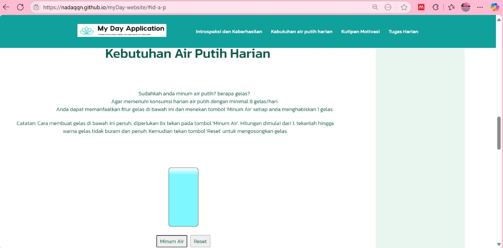
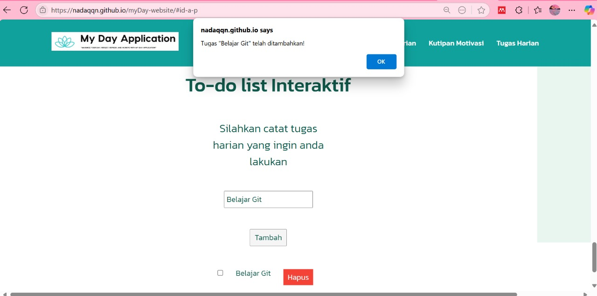

# 🌅 MyDay Web App – Your Daily Companion

Welcome! 👋  
**Maximize Your Day, Reflect, Refresh, and Achieve with MyDay Web App!** 🚀  
This is more than just a planner — it’s your daily personal assistant designed to support your *mental clarity*, *hydration*, *motivation*, and *productivity*. 💪🧠💧

---

## 🌟 Why MyDay?

We often forget how powerful a good day can be when structured well.  
**MyDay** helps you:

- Reflect on what went right ✅  
- Improve from what went wrong 🔁  
- Stay hydrated 💧  
- Stay inspired 💬  
- Stay on track with your goals 🗂️  

---

## 🧭 Key Features

1. 🪞 **Introspection & Achievements**
   - A thoughtful journaling section to reflect on your day.
   - Jot down **gratitude**, **successes**, and **mistakes to learn from**.
   - Great for personal growth and mental clarity.

2. 💧 **Daily Water Tracker**
   - Track how much water you’ve consumed today.
   - Helps maintain focus and physical well-being.
   - Stay on top of your hydration goals!

3. 💬 **Motivational Quotes**
   - Randomly displayed uplifting quotes to spark your spirit.
   - Perfect for those tough mornings or lazy afternoons.

4. 📋 **Daily Tasks**
   - Add and manage your to-dos for the day.
   - Simple and effective task input to boost productivity.

---

## 🧰 Tech Stack

- 🌐 HTML, CSS, JavaScript
- 🧠 Simple data management with local storage
- 🧼 Clean UI/UX for smooth user experience
- 📱 Responsive design for mobile & desktop

---

## 📸 Preview

Live site: [🔗 MyDay App Demo](https://nadaqqn.github.io/myDay-website/)

---

## 🔮 Future Plans

- 📊 Weekly summary & analytics
- 🔔 Reminder notifications for tasks & water intake
- 🎨 Customizable themes or backgrounds
- 🗃️ Cloud storage or user authentication for cross-device data

---

## 🙌 How to Use

1. Reflect each evening in the **Introspection** tab.  
2. Log every glass of water in the **Hydration** tracker.  
3. Read a **motivational quote** each day for inspiration.  
4. List and complete your **daily tasks**.  
Your new habit of winning the day starts here! 🏆

---

## 🤝 Let’s Connect

Want to improve the app together? Or need help building something similar? I’d love to hear from you!

- 💌 Linktr.ee: https://linktr.ee/qonitaqq

---

> *“Small daily improvements over time lead to stunning results.”* – Robin Sharma ✨

---

Thanks for checking out MyDay App!  
If it inspires you, consider giving the repo a ⭐️ and share the love! 💖
